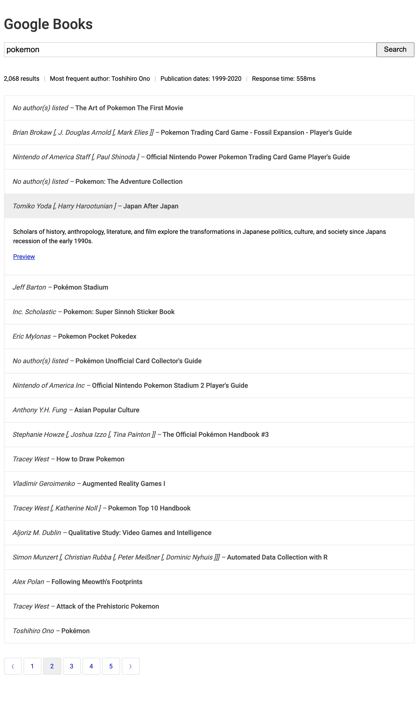

# Google Books Search

This is a Google Books search Proof-of-concept React application. One of the challenges was Google Books API only allowing a maximum of 40 results per request.



#### 1. Requirements

You will need to create a config.js file within the /src/ directory. The config.js should contain:

```javascript
const API_KEY = "your-api-key";

export { API_KEY };
```

You can acquire a Google Books API key here: https://developers.google.com/books/docs/v1/using#APIKey.

#### 2. Environment

Ensure Node and NPM are installed. You can determine this by running the terminal commands:

```sh
$ node -v
$ npm -v
```

There should be a version number for each. If not, refer to the following steps:

- For installing node, visit: https://nodejs.org/en/download/

#### 3. Clone the project

Once you've added your SSH key to GitHub, clone the project into a folder of your choice:

```sh
$ git clone git@github.com:ryanwellsdotcom/google-book-search.git
```

#### 4. Install dependencies

CD into the project folder and run npm install:

```sh
$ cd google-book-search
$ npm install
```

This will install all of the packages required to build the project.

#### 4. Start the project for development

To start the project and watch for changes, run:

```sh
$ npm start
```

Ctrl C will stop the dev server.

#### 5. Build the project for production

To build the project for production, run:

```sh
$ npm build
```

All of the production assets will be placed in a 'build' directory.
<br/>
<br/>
